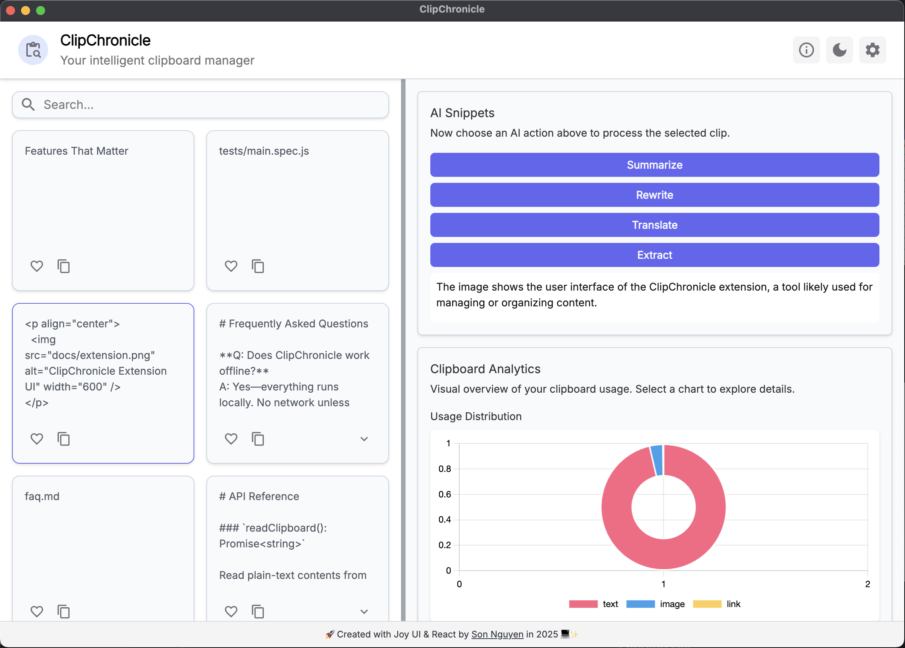

# ClipChronicle - Make Your Clipboard Great Again 📋🚀

<p align="center">
  
  
  
  
  
  
  
  
  
  
  
  
  
  
  
  
  
  
  
  
  
  
  
  
  
  
  
  
  
  
  
  
  
  
</p>

> [!IMPORTANT]
> **ClipChronicle - your clipboard’s second brain**
>
> An AI-powered, **local-first** clipboard manager that captures, organizes, and recalls every snippet across desktop and browser - completely offline.
>
> **Currently live at: https://clipchronicle.vercel.app** 🚀

## Table of Contents

- [Why ClipChronicle?](#why-clipchronicle)
- [Feature Highlights](#feature-highlights)
  - [AI Power](#-ai-power)
  - [Unlimited History](#-unlimited-history)
  - [Instant Recall](#-instant-recall)
  - [Local-Only Privacy](#-local-only-privacy)
  - [Cross-Platform Delivery](#-cross-platform-delivery)
- [Testing & Quality](#testing--quality)
- [User Interfaces](#user-interfaces)
  - [Extension UI](#extension-ui)
  - [Extension Options Page](#extension-options-page)
  - [Native Desktop App](#native-desktop-app)
  - [Landing Site](#landing-site)
- [Demo Videos](#demo-videos)
  - [Native Desktop App Demo](#native-desktop-app-demo)
  - [Browser Extension App Demo](#browser-extension-app-demo)
- [Technology Stack](#technology-stack)
- [Quick Start](#quick-start)
  - [Prerequisites](#prerequisites)
  - [Clone & Install](#clone--install)
  - [Setup & Launch the Landing Site](#setup--launch-the-landing-site)
  - [Setup & Run the Desktop App](#setup--run-the-desktop-app)
  - [Setup & Build the Extension](#setup--build-the-extension)
- [Environment Configuration](#environment-configuration)
- [Continuous Delivery](#continuous-delivery)
- [Contributing](#contributing)
- [License](#license)
- [Contact](#contact)

## Why ClipChronicle?

ClipChronicle is designed to be the ultimate clipboard companion, addressing the limitations of traditional clipboard managers:

- **Not being able to see what you copied** – Traditional clipboard managers often only show the last copied item, making it hard to find older snippets.
- **Lack of organization** – Many clipboard managers lack robust tagging or folder systems, leading to chaos as your history grows.
- **Limited search capabilities** – Searching through clipboard history can be slow and imprecise, especially with large datasets.
- **Cannot update/delete copied items** – Once something is copied, it’s often set in stone, making it hard to correct mistakes or update information.
- **No AI assistance** – Most clipboard managers do not leverage AI to enhance productivity, such as summarizing or translating snippets.
- **Privacy concerns** – Many clipboard managers store data in the cloud, raising security and privacy issues.

Thus, ClipChronicle was born to solve these problems with a **local-first**, AI-enhanced clipboard experience that captures everything you copy, organizes it intelligently, and makes it instantly searchable—all while keeping your data private and secure:

- **Capture everything** – text, rich text, images, colors, code snippets, and more.
- **Never lose a copy** – unlimited history that survives reboots and reinstalls.
- **AI-enhanced productivity** – smart actions like summarization, translation, and refactoring at your fingertips.
- **Local-first design** – everything runs on your machine, ensuring privacy and speed.
- **Manage clipboard with ease** – organize snippets with favorites, manual delete, and smart tags.
- **Instant search** – fuzzy lookup returns results in under 10 ms at a million rows.
- **Visualizations** – analytics dashboard shows copied item type, copy frequency, and more to help you understand your clipboard usage!
- **Cross-platform** – available as a desktop app and a browser extension.
- **Cross-browser** - our browser extension is also available on/compatible with browsers other than Google Chrome, such as Firefox and Microsoft Edge!
- **Open source** – built with love by the community, for the community. All code are fully open and transparent.
- **Dark/Light mode** - the native app also features a dark mode for a comfortable viewing experience at night, plus a light mode for daytime use.

> [!NOTE]
> ClipChronicle is not just another clipboard manager; it’s a **second brain for your clipboard**. It empowers you to focus on what matters most - your work - while it takes care of the mundane task of managing your copied content!

## Feature Highlights

ClipChronicle is packed with features to supercharge your clipboard experience:

### ✨ AI Power

| Action              | Details                                                                             |
| ------------------- | ----------------------------------------------------------------------------------- |
| **One-click tasks** | Summarize, translate, refactor, sentiment analysis, unit conversions                |
| **Smart tags**      | Topic, language, file type, sentiment - stored in SQLite FTS5                       |
| **Magic Paste**     | Strips formatting, trackers, line numbers, or Markdown artifacts with regex presets |

### 🗂️ Unlimited History

- Captures **text, rich text, images, colors, and code**.
- Delta compression keeps the database tiny (\~3 MiB per 10 000 text items).
- Organize with folders, tags, and favorites.

### ⚡ Instant Recall

- Trigram + BM25 FTS index.
- Global **hyper-key (⇪)** HUD with quick-paste shortcuts.
- Analytics dashboard for copy frequency, source apps, and time-of-day heatmap.

### 🛡️ Local-Only Privacy

- No outbound requests unless backups are enabled.
- Hardened Electron context, strict CSP, sandboxed preload scripts.
- Optional SQLCipher AES-256 encryption (`CC_SQLCIPHER_KEY`).

### 🖥️ Cross-Platform Delivery

| Package                  | Tech                                                  | Target                                 |
| ------------------------ | ----------------------------------------------------- | -------------------------------------- |
| `electron-app/`          | Electron 29, React 19, Rust clipboard hooks, and more | Windows 10+, macOS 12+, Linux AppImage |
| `extension/`             | Manifest V3, TypeScript, Rollup, and more             | Chrome, Edge                           |
| `clipchronicle-landing/` | Next.js 14, Tailwind CSS, Framer Motion, and more     | Static landing site for marketing      |

### 🧪 Testing & Quality

- **Unit tests** with Vitest and React Testing Library.
- **End-to-end tests** with Playwright.
- **Linting** with ESLint and Prettier.
- **Commit hooks** with husky and lint-staged.
- **CI/CD** with GitHub Actions and Ansible for automated builds, tests, and releases with AWS and Vercel.

## User Interfaces

### Extension

#### Extension UI

<p align="center">
  
</p>

#### Extension Options Page

<p align="center">
  
</p>

### Native Desktop App

<p align="center">
  
</p>

### Landing Site

<p align="center">
  
</p>

## Demo Videos

Click on the thumbnails below to view our app's demo videos!

### Native Desktop App Demo

<p align="center">
  <a href="https://youtu.be/XSrKG96jKAI" target="_blank">
    
  </a>
</p>

> [!TIP]
> Link not working? Copy and paste [https://youtu.be/XSrKG96jKAI](https://youtu.be/XSrKG96jKAI) in your browser to open!

### Browser Extension App Demo

<p align="center">
  <a href="https://youtu.be/I7jZ1OjuutM" target="_blank">
    
  </a>
</p>

> [!TIP]
> Link not working? Copy and paste [https://youtu.be/I7jZ1OjuutM](https://youtu.be/I7jZ1OjuutM) in your browser to open!

## Technology Stack

ClipChronicle is built with a modern stack that ensures performance, security, scalability, and maintainability:

- **Landing Site** – Next.js 14 • React • Tailwind CSS • Framer Motion • Shadcn UI • TypeScript • Lucide Icons • Vercel for hosting
- **Desktop App** – Electron 29 • React • TypeScript • SQLite FTS5 • Rust clipboard hooks • SQLCipher • Material Joy UI
- **Extension** – MV3 APIs • Web Workers for syntax highlighting • TypeScript • Rollup • Lucide Icons • Chrome Store for distribution
- **Tooling** – pnpm workspaces • Playwright • ESLint/Prettier • Shell scripts • Makefile for build tasks • MKDocs for documentation • Docker for development environment
- **CI/CD** – GitHub Actions matrix build & notarization • Ansible for deployment • AWS S3 for encrypted backups and native app hosting • Vault for secrets management • Terraform for infrastructure as code • Nomad for orchestration • Consul for service discovery • CycloneDX for SBOM generation

## Quick Start

ClipChronicle is designed to be easy to set up and use. Follow these steps to get started quickly:

### Prerequisites

Before starting, ensure you have the following installed:

- `Node.js` (v18+)
- `pnpm` (install via `npm install -g pnpm`) or `npm` or `yarn`
- `Git`
- `Rust` (for clipboard hooks, optional but recommended)
- `Docker` (for development environment, optional)

### Clone & Install

```bash
git clone https://github.com/hoangsonww/ClipChronicle-Cross-Platform-App.git
cd ClipChronicle-Cross-Platform-App
npm install
```

### Setup & Launch the Landing Site

```bash
cd clipchronicle-landing
npm install --legacy-peer-deps
npm run dev   # http://localhost:3000
```

> [!NOTE]
> We are using `--legacy-peer-deps` to avoid peer dependency issues with React 19 and Shadcn UI.

### Setup & Run the Desktop App

```bash
cd ../electron-app
npm install
npm start
```

To build the desktop app for production:

```bash
npm run make
```

This will create platform-specific installers in the `out` subdirectory, with a `.zip` for Linux, `.dmg` for macOS, and `.exe` for Windows.

### Setup & Build the Extension

First, build the extension so that you can test it on your browser:

```bash
cd ../extension
npm run build
```

Then load `extension/dist` as an unpacked extension at `chrome://extensions`.

> [!IMPORTANT]
> Make sure to enable the **Developer mode** toggle in the top right corner of the Extensions page.
>
> Also, ensure that you have enabled necessary permissions for the extension. This can be done by right-clicking the extension icon, selecting **View Web Permissions**, and granting access to all sites or specific domains as needed.

> [!TIP]
> Sometimes, the extension may not work immediately after loading. If you encounter issues, try reloading the extension or restarting your browser (or reloading the page that the extension is active on).

> [!NOTE]
> Due to browser security policies, the extension may not **ALWAYS** function correctly on all websites. If you encounter issues, try disabling any conflicting extensions or adjusting the extension's permissions.

## Environment Configuration

Environment variables are completely optional! However, if you want to customize your ClipChronicle experience, you can set the following variables in a `.env.local` file inside the relevant package directory:

| Variable           | Example                                | Effect                      |
| ------------------ | -------------------------------------- | --------------------------- |
| `CC_DB_PATH`       | `C:\Users\me\.clipchronicle\db.sqlite` | Custom database location    |
| `CC_BACKUP_BUCKET` | `s3://my-bucket/snippets`              | Enable encrypted S3 backups |
| `CC_DISABLE_AI`    | `true`                                 | Disable GPT features        |
| `CC_SQLCIPHER_KEY` | `My$up3rS3cr3t`                        | Encrypt database            |

Place variables in `.env.local` inside the relevant package. (i.e. `clipchronicle-landing/.env.local`, `electron-app/.env.local`, or `extension/.env.local`).

## Testing & Quality

We take quality seriously at ClipChronicle. Our testing strategy includes:

- **Unit tests** – Vitest + React Testing Library
- **End-to-end** – Playwright (desktop via Electron Runner and extension via Chromium)
- **Linting** – Airbnb config + Prettier
- **Commit hooks** – husky + lint-staged

Run everything:

```bash
pnpm test:all
```

> [!TIP]
> Make sure you have installed the necessary dependencies for testing before running the tests!

## Continuous Delivery

To ensure a smooth release process, we use GitHub Actions for CI/CD. The workflow is as follows:

1. `pnpm changeset` bumps version and generates changelog.
2. Merge to `main` triggers the release workflow:

- Static site → Vercel
- Electron → notarize (macOS) / sign (EV cert) → upload artifacts
- Extension → ZIP draft in Chrome Web Store

3. SBOM (`cyclonedx`) and SHA-256 checksums attached to the GitHub release.

## Contributing

We welcome contributions to ClipChronicle! Whether you want to report a bug, suggest a feature, or submit code, your input is valuable. Here’s how to get involved:

1. Fork and create a feature branch.
2. Make your changes and ensure they are well-tested.
3. Commit using **Conventional Commits** (e.g., `feat:`, `fix:`).
   - _**Note**: Before committing, run `npm run format` in the root directory to ensure EVERYTHING is CORRECTLY FORMATTED!_
4. Open a pull request - CI must pass. We'll review it and provide feedback, and merge it if everything looks good!
5. All contributions are accepted under the MIT license and CLA.

## License

ClipChronicle is released under the **MIT License**. See [LICENSE](LICENSE) for details.

> [!WARNING]
> You may not use this software for any illegal activities, including but not limited to:
>
> - Unauthorized access to computer systems
> - Distribution of copyrighted material without permission
> - Any other activities that violate local, state, or federal laws
>
> Additionally, this project may only be used for noncommercial and educational purposes. You must credit the original authors and contributors when using this software in any public or commercial projects of yours.

## Contact

For any inquiries, feedback, or support, please reach out via:

- Email: [hoangson091104@gmail.com](mailto:hoangson091104@gmail.com)
- GitHub: [hoangsonww](https://github.com/hoangsonww)
- LinkedIn: [Son Nguyen](https://www.linkedin.com/in/hoangsonw/)

Additionally, there are many resources available to help you get started and make the most of ClipChronicle:

- Bug reports: [GitHub **Issues**](https://github.com/hoangsonww/ClipChronicle-Cross-Platform-App/issues)
- Questions: [GitHub **Discussions**](https://github.com/hoangsonww/ClipChronicle-Cross-Platform-App/discussions)
- Security: **[Security Policy](.github/SECURITY.md)**
- Contributions: [Contributing Guidelines](.github/CONTRIBUTING.md)

---

Enjoy clipping ✂️🧠 and chronicling your clipboard with ClipChronicle! 🚀
